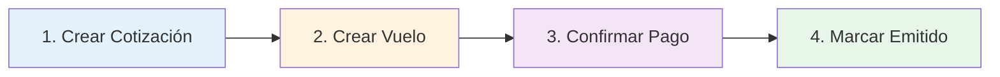
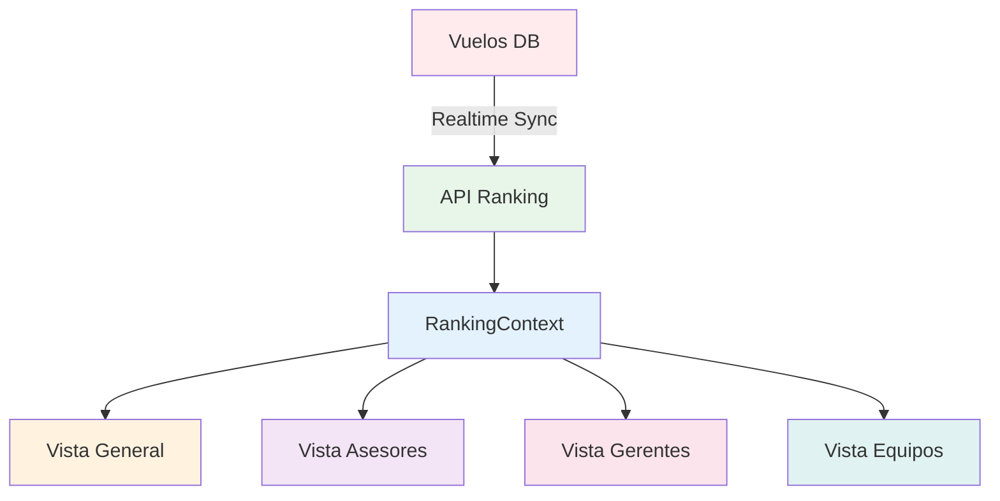
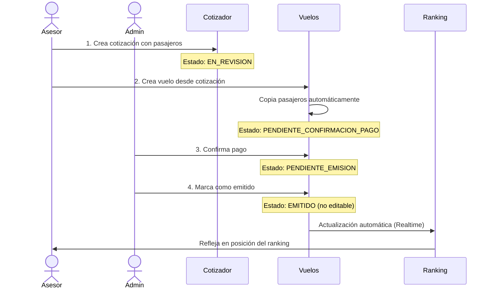

# 📊 Estado Actual: Módulos de Ventas y Ranking

**Fecha:** Abril 2026  
**Estado:** ✅ Funcional en Producción

---

## 🎯 Resumen Ejecutivo

Ambos módulos están **completamente implementados y operativos**. El flujo de ventas maneja desde cotización hasta emisión, y el ranking muestra métricas en tiempo real con conversión de monedas.

---

## 📝 MÓDULO DE VENTAS

### Flujo Completo Implementado



### 1️⃣ Crear Cotización

**Ubicación:** `src/routes/cotizaciones.js` + `src/services/cotizacionesService.js`

| Característica | Estado | Detalles |
|---------------|--------|----------|
| **Endpoint** | ✅ Funcionando | `POST /api/cotizaciones` |
| **Campos** | ✅ Completo | nombre_cliente, tipo_vuelo, origen, destino, fecha_salida, moneda, precio |
| **Pasajeros** | ✅ Integrado | Vista individual y múltiple (array de pasajeros) |
| **Estados** | ✅ Activo | `EN_REVISION` (inicial), `APROBADA`, `RECHAZADA` |
| **Validaciones** | ✅ Implementado | Solo el creador puede editar su cotización |
| **Historial** | ✅ Automático | Trigger DB registra cambios de estado |

**Funcionalidades:**
- ✅ Crear cotización con pasajeros
- ✅ Editar cotización (solo creador)
- ✅ Cambiar estado con razón de rechazo
- ✅ Eliminar cotización (cascade a pasajeros)

---

### 2️⃣ Crear Vuelo

**Ubicación:** `src/routes/vuelos.js` + `src/services/vuelosService.js`

| Característica | Estado | Detalles |
|---------------|--------|----------|
| **Endpoint** | ✅ Funcionando | `POST /api/vuelos` |
| **Vinculación** | ✅ Implementado | Se puede crear desde cotización (cotizacion_id) |
| **Pasajeros** | ✅ Completo | Se copian automáticamente desde cotización |
| **Adjuntos** | ✅ Activo | Múltiples archivos por vuelo |
| **Estado Inicial** | ✅ Definido | `PENDIENTE_CONFIRMACION_PAGO` |
| **Edición** | ✅ Controlado | Límite de intentos, permisos por rol, no editable si `EMITIDO` |

**Flujo de Estados:**
```
PENDIENTE_CONFIRMACION_PAGO → PENDIENTE_EMISION → EMITIDO
```

**Funcionalidades:**
- ✅ Crear vuelo manualmente o desde cotización
- ✅ Copiar pasajeros de cotización a vuelo: `POST /api/vuelos/:vueloId/copiar-pasajeros`
- ✅ Editar vuelo con trazabilidad (razón de edición obligatoria)
- ✅ Filtrado por rol (Asesor ve sus vuelos, Gerente ve su equipo, Admin ve todo)

---

### 3️⃣ Confirmar Pago

**Ubicación:** `src/routes/vuelos.js:234` + `src/services/vuelosService.js:307`

| Característica | Estado | Detalles |
|---------------|--------|----------|
| **Endpoint** | ✅ Funcionando | `PATCH /api/vuelos/:id/confirmar-pago` |
| **Permiso** | ✅ Restringido | Solo Admin |
| **Cambio Estado** | ✅ Automático | `PENDIENTE_CONFIRMACION_PAGO` → `PENDIENTE_EMISION` |
| **Trazabilidad** | ✅ Registrado | `pago_confirmado_por`, `pago_confirmado_at` |

**Request Body:**
```json
{
  "userId": "uuid-del-admin"
}
```

---

### 4️⃣ Emisión

**Ubicación:** `src/routes/vuelos.js:264` + `src/services/vuelosService.js:340`

| Característica | Estado | Detalles |
|---------------|--------|----------|
| **Endpoint** | ✅ Funcionando | `PATCH /api/vuelos/:id/marcar-emitido` |
| **Cambio Estado** | ✅ Automático | `PENDIENTE_EMISION` → `EMITIDO` |
| **Bloqueo Edición** | ✅ Activo | Vuelos emitidos NO se pueden editar |
| **Trazabilidad** | ✅ Registrado | `emitido_por`, `emitido_at` |

**Request Body:**
```json
{
  "userId": "uuid-del-usuario"
}
```

---

## 🏆 MÓDULO DE RANKING

### Vista General del Sistema

**Ubicación:** `src/routes/rankings.js` + `dashboard/src/contexts/RankingContext.js`



### Características Principales

| Característica | Estado | Detalles |
|---------------|--------|----------|
| **Endpoint** | ✅ Funcionando | `GET /api/rankings/global?moneda=USD\|EUR` |
| **Tiempo Real** | ✅ Activo | Suscripción Supabase a tabla `vuelos` |
| **Multi-moneda** | ✅ Implementado | Conversión automática USD ↔ EUR |
| **Vistas** | ✅ Completo | General, Asesores, Gerentes, Equipos |
| **Auto-ciclo** | ✅ Activo | Cambia vista cada 4s, moneda cada 8s (si no hay interacción) |

### Métricas Calculadas

Para cada usuario/equipo se calcula:

- **Total Vuelos:** Cantidad de vuelos registrados
- **Emitidos:** Vuelos con estado `EMITIDO`
- **% Conversión:** `(emitidos / total) * 100`
- **Monto Total:** Suma de `total_cotizacion` convertido a moneda de vista
- **Fee Agencia Total:** Suma de `fee_agencia` de todos los pasajeros

### Ordenamiento y Ranking

**Criterios de posición (en orden):**
1. Total de vuelos registrados
2. Cantidad de emitidos
3. Monto total

**Medallas:**
- 🥇 1er lugar
- 🥈 2do lugar
- 🥉 3er lugar

### Vista por Equipos

- ✅ **Agrupación:** Solo usuarios con `equipo_id` (gerentes quedan fuera)
- ✅ **Expandible:** Click para ver miembros del equipo
- ✅ **Métricas agregadas:** Suma de todos los miembros
- ✅ **Colores personalizados:** Cada equipo tiene su color (`equipos.color`)

---

## 🔄 Flujo de Usuario Completo

### Caso de Uso: Venta de Vuelo



---

## 📊 Componentes Frontend

### Cotizador

**Ubicación:** `dashboard/src/components/cotizador/`

- ✅ `CotizadorForm.jsx` - Formulario principal
- ✅ `PasajerosManager.jsx` - Gestión de pasajeros (individual/múltiple)
- ✅ `CotizadorTutorial.jsx` - Tutorial interactivo

### Ranking

**Ubicación:** `dashboard/src/components/ranking/`

- ✅ `RankingGlobal.jsx` - Vista principal con tabs y animaciones
- ✅ Tablas responsivas con filtros
- ✅ Indicadores en tiempo real (badge "Live")

---

## ✅ Validaciones y Seguridad

### Cotizaciones
- ✅ Solo el creador puede editar
- ✅ Campos obligatorios validados
- ✅ Razón de edición mínimo 10 caracteres

### Vuelos
- ✅ No se pueden editar si están `EMITIDO`
- ✅ Límite de ediciones disponibles
- ✅ Permisos por rol (Asesor/Gerente/Admin)
- ✅ Trazabilidad completa de cambios

### Ranking
- ✅ Visibilidad filtrada por rol
- ✅ Conversión de monedas con tasas actualizadas
- ✅ Validación de estados (excluye `CANCELADO`)

---

## 🎨 Características UX

### Cotizador
- Formulario multi-paso
- Vista individual o múltiple pasajeros
- Validación en tiempo real
- Tutorial para nuevos usuarios

### Vuelos
- Estados visuales con colores
- Badges de permisos
- Historial de ediciones
- Adjuntos con preview

### Ranking
- **Auto-cycle:** Cambia vista/moneda automáticamente
- **Hover pause:** Detiene ciclo al interactuar
- **Animaciones suaves:** Transiciones entre vistas
- **Badges realtime:** Indicador "Live" cuando está conectado
- **Medallas:** Top 3 con emojis
- **Vista expandible:** Equipos con drill-down

---

## 🚀 Estado de Integración

| Módulo | Backend | Frontend | DB | Realtime |
|--------|---------|----------|----|---------| 
| **Cotizaciones** | ✅ | ✅ | ✅ | ✅ |
| **Vuelos** | ✅ | ✅ | ✅ | ✅ |
| **Ranking** | ✅ | ✅ | ✅ | ✅ |
| **Pasajeros** | ✅ | ✅ | ✅ | - |
| **Adjuntos** | ✅ | ✅ | ✅ | - |

---

## 📌 Endpoints Principales

### Cotizaciones
```
POST   /api/cotizaciones              - Crear
GET    /api/cotizaciones/:id          - Obtener
PUT    /api/cotizaciones/:id          - Actualizar
DELETE /api/cotizaciones/:id          - Eliminar
PATCH  /api/cotizaciones/:id/estado   - Cambiar estado
```

### Vuelos
```
POST   /api/vuelos                              - Crear
GET    /api/vuelos/:id                          - Obtener
PUT    /api/vuelos/:id/editar                   - Editar con validaciones
PATCH  /api/vuelos/:id/confirmar-pago           - Confirmar pago (Admin)
PATCH  /api/vuelos/:id/marcar-emitido           - Marcar emitido
POST   /api/vuelos/:vueloId/copiar-pasajeros    - Copiar desde cotización
```

### Ranking
```
GET    /api/rankings/global?moneda=USD|EUR      - Ranking completo
```

---

## 🎯 Conclusión

**Estado General:** ✅ **FUNCIONAL Y OPERATIVO**

Todos los componentes del flujo de ventas están implementados y funcionando:
- ✅ Creación de cotizaciones con pasajeros
- ✅ Conversión a vuelos con copia automática de datos
- ✅ Confirmación de pago con trazabilidad
- ✅ Emisión final con bloqueo de edición
- ✅ Ranking en tiempo real con múltiples vistas y conversión de monedas

El sistema está listo para uso en producción con validaciones de seguridad, permisos por rol, y trazabilidad completa de todas las operaciones.
